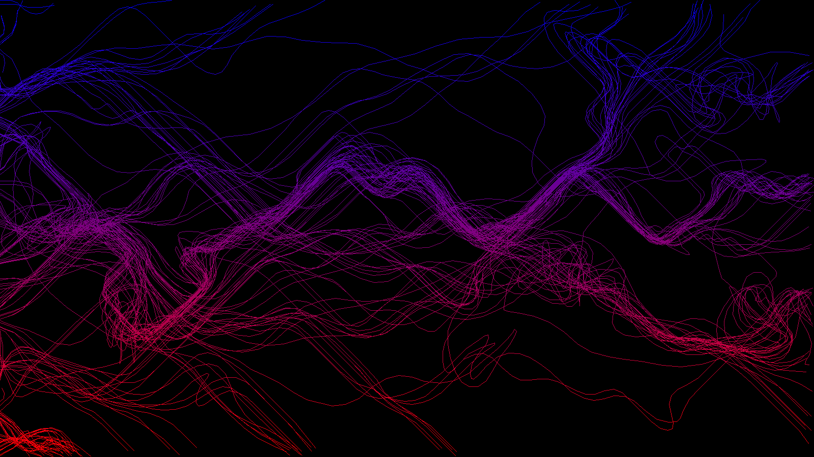

# Flow Fields Simulation

> ***Perlin Noise, Vector Fields, Physics Simulations***

(Example Simulation)

- This simulation was inspired by Ken Perlin, creator of Perlin Noise, a sum of complex equations that can output "hills and valleys" of values. Simply put, Perlin Noise can generate random values that are similar to adjacent numbers. This simulation uses a 2D Perlin Noise field to generate the differing vector angles across the grid.
- A flow field itself is a group of particles dropped onto a 2D vector field. The particles flow in the direction of the nearest vector to their position, hence _flow_ fields.
- While `pygame` was used to display the simulation itself, the `perlin_noise` module was used to adjust the number of octaves, drastically changing the results of the simulation.
- Running `main.py` without changes will run in HEADLESS mode, where the display is turned off to save resources to instead focus on calculations. After a set number of repetitions, the program will return an image, `output.png`, displaying the path different particles took through the vector field.
